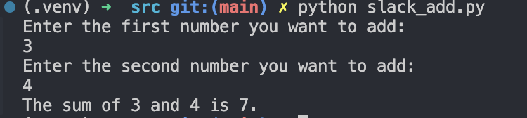

# Repo for practicing writing python scripts

This repository utilizes GitHub Actions to run a Python package workflow that **formats**, **lints**, and **tests** the python scripts in the repository, followed by **installing the required packages**. The workflow is defined in the `.github/workflows/cicd.yml` and 'Makefile' files. The code coverage is tracked using `codecov`.

- **Formatting**: The python scripts are formatted using `black`.

- **Linting**: The python scripts are linted using `pylint` and `mypy`.

- **Testing**: The python scripts are tested using `pytest`.
    - The tests are located in the `tests` directory.

## Description
This repository contains python scripts that I have written to practice writing python scripts. The scripts are based on prompts from the [Wise Owl Python Exercises](https://www.wiseowl.co.uk/python/exercises/python/).

### Table of Contents
1. [User Inputs: The meaning of life python script](./src/theMeaningofLife.py)
    

1. [Modify List: Shipping_list](./src/shopping_list.py)
    

1. [Extract Data: Extract countries from a continent file](./src/extract_countries.py)
    

1. [Simple sum of two numbers that input from the user](./src/slack_add.py)
    
    
### References
- [Python Script Prompts](https://www.wiseowl.co.uk/python/exercises/python/)