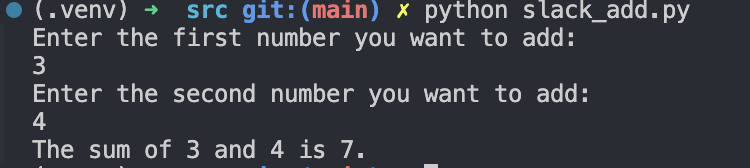
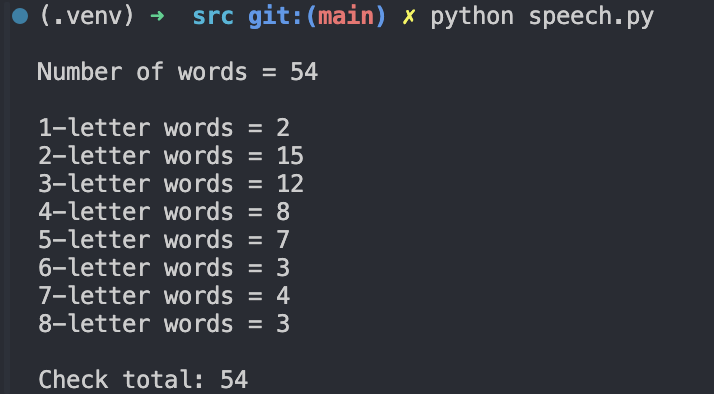
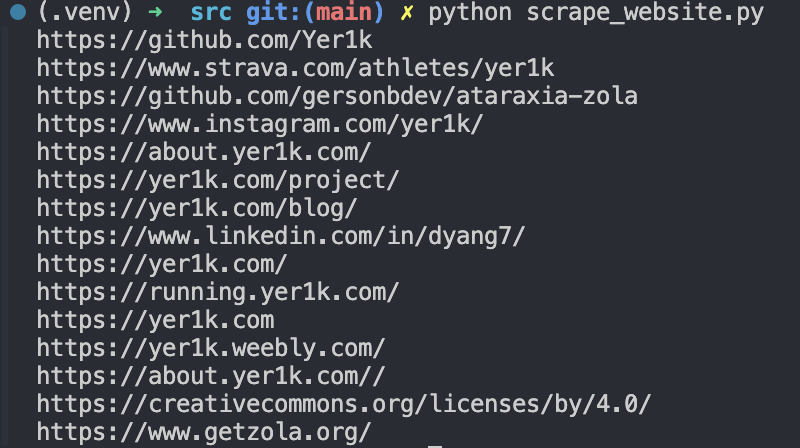

1. The meaning of life python script
    For this exercise you are invited to write a program which asks a user for two bits of information:

    - Their name; and

    - What they think is the meaning of life.

    ```python
    def theMeaningOfLife() -> None:
        """
        Ask user for their name and what they think is the meaning of life,
        then print a summary of the results.
        """
        try:
            person_name = input("What is your name?\n")
            life_meaning = input(
                f"Hello {person_name}, what do you think is the meaning of life?\n"
            )
        except KeyboardInterrupt:
            print("\nProgram interrupted by user.")
        except Exception as e:
            print(f"An error occurred: {str(e)}")

        summary = "\nSUMMARY OF RESULTS\n"
        summary += f"\nName ==> {person_name}\n"
        summary += f"\nMeaning of Life ==> {life_meaning}\n"

        print(summary)


    if __name__ == "__main__":
        theMeaningOfLife()
    ```

    

1. Modify List: Shopping_list
    Use a list to create a shopping list and change an item in the list.

    ```python
    """Use a list to create a shopping list and change an item in the list."""


    def change_shopping_list(index: int, item: str) -> None:
        """
        Demo of how to change an item in a shopping list.
        """
        shopping_list = ["Double cream", "Single cream", "Eggs", "Oreos"]
        shopping_list[index] = item

        summary = "\nSHOPPING LIST\n"
        summary = summary + "\n" + "\n\n".join(shopping_list)
        print(summary)


    if __name__ == "__main__":
        change_shopping_list(3, "Healthier option")
    ```
    


1. Extracting Data: Extract countries from a file and print them out
    Extract the countries from the file `[continent].csv` and print them out.

    ```python
    """Module to extract countries from a file and print them out."""


    def get_contents_of_file(continent_name: str) -> str:
        """
        Read the contents of a file for a given continent name.
        """
        try:
            with open(f"../data/{continent_name}.csv") as continent_file:
                lines = continent_file.read()

        except FileNotFoundError:
            lines = None

        return lines


    def get_country_dict(country_list: str) -> dict:
        """
        Take a list of countries and cities and turn them into a dictionary.
        """
        lines = country_list.splitlines()
        countries = {}

        for line in lines:
            combine = line.split(",")
            country, city = combine
            countries[country] = city

        return countries


    def print_results(continent_name: str, countries: dict) -> None:
        """
        Print out the countries and cities for a given continent.
        """
        print(continent_name)
        print("-" * len(continent_name))

        for country_name, city_name in countries.items():
            print(f"{country_name} ({city_name})")


    if __name__ == "__main__":
        continent_name = "Oceania"
        country_list = get_contents_of_file(continent_name)

        if country_list is None:
            print(f"There are no countries for {continent_name}")
        else:
            countries = get_country_dict(country_list)
            print_results(continent_name, countries)
    ```
    


1. Simple sum of two numbers that input from the user
    ```python
    """Module to add two numbers that input from the user, and print the sum of them."""

    import sys


    def add_two_numbers() -> None:
        """
        Function to add two numbers that input from the user,
        and print the sum of them.
        """
        try:
            number1 = int(input("Enter the first number you want to add:\n"))
            number2 = int(input("Enter the second number you want to add:\n"))
        except ValueError:
            print("Invalid input. Please enter valid integers.")
            sys.exit(1)
        nums_sum = number1 + number2
        print(f"The sum of {number1} and {number2} is {nums_sum}.")


    if __name__ == "__main__":
        add_two_numbers()
    ```
    

1. Analyzing the word counts of the length of words in a speech
    ```python
    """Module for analyzing the word counts of the length of words in a speech."""


    def analyse_word_counts(speech: str) -> None:
        """
        Function to analyze the word counts of the length of words in a speech.
        """
        # split into the different words
        words = speech.split(" ")

        word_index = 0
        for word in words:
            # get rid of punctuation and new lines
            # (using translation table for better performance)
            translation_table = str.maketrans("", "", ",.!?;\n")
            word = word.translate(translation_table)

            # turn to lower case
            word = word.lower()

            # write changes back to list
            words[word_index] = word

            # increment index
            word_index += 1

        # show number of words
        print(f"\nNumber of words = {len(words)}\n")

        # loop over number of letters from 1 to 20
        checksum = 0
        for num in range(0, 20):

            # show number of words with this many letters
            number_words = len([x for x in words if len(x) == num])
            if number_words > 0:
                checksum += number_words
                print(f"{num}-letter words = {number_words}")

        # show the total
        print(f"\nCheck total: {checksum}")


    if __name__ == "__main__":

        # Julius Caesar Act 4, Scene 3, 218–224
        BRUTUS_SPEECH = (
            "There is a tide in the affairs of men \n"
            "Which, taken at the flood, leads on to fortune; \n"
            "Omitted, all the voyage of their life \n"
            "Is bound in shallows and in miseries. \n"
            "On such a full sea are we now afloat, \n"
            "And we must take the current when it serves, \n"
            "Or lose our ventures."
        )

        analyse_word_counts(BRUTUS_SPEECH)
    ```
    

1. Use BeautifulSoup to compile a list of external links for any website
    ```python
    """Use BeautifulSoup to compile a list of external links for any website"""

    import requests
    from bs4 import BeautifulSoup


    def scrape_website(target_url: str) -> None:
        """
        Function to scrape a website for external links.
        """
        # get the HTML page for this
        try:
            html_page = requests.get(target_url, timeout=5).text
        except requests.exceptions.RequestException as e:
            print(f"Error: {e}")
            return

        # get the HTML soup for this using default parser
        soup = BeautifulSoup(html_page, "html.parser")

        # get all the hyperlinks
        links = soup.find_all("a")  # a: anchor tag for hyperlinks

        # external links
        external_links = []

        # list them out
        for link in links:

            # get this link's URL
            url = str(link.get("href"))

            # if external link, add it to list
            if not url.startswith("/"):
                if url.startswith("http"):
                    external_links.append(url)

        # get list of unique links
        unique_links = set(external_links)
        final_list = list(unique_links)

        if not final_list:
            print("No links found")
        else:
            # list final links out
            for final_link in final_list:
                print(final_link)


    if __name__ == "__main__":

        # TARGET_URL_DEFAULT = "https://www.google.com/"
        TARGET_URL_DEFAULT = "https://www.yer1k.com/"

        scrape_website(TARGET_URL_DEFAULT)
    ```
    