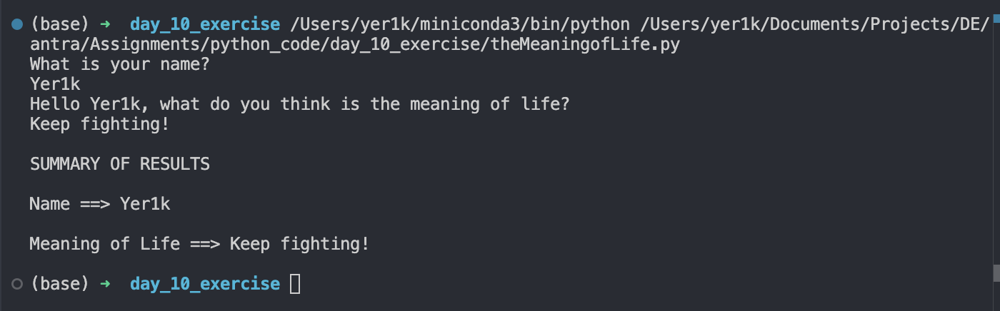

1. The meaning of life python script
    For this exercise you are invited to write a program which asks a user for two bits of information:

    - Their name; and

    - What they think is the meaning of life.

    ```python
    def theMeaningOfLife() -> None:
        """
        Ask user for their name and what they think is the meaning of life,
        then print a summary of the results.
        """
        try:
            person_name = input("What is your name?\n")
            life_meaning = input(
                f"Hello {person_name}, what do you think is the meaning of life?\n"
            )
        except KeyboardInterrupt:
            print("\nProgram interrupted by user.")
        except Exception as e:
            print(f"An error occurred: {str(e)}")

        summary = "\nSUMMARY OF RESULTS\n"
        summary += f"\nName ==> {person_name}\n"
        summary += f"\nMeaning of Life ==> {life_meaning}\n"

        print(summary)


    if __name__ == "__main__":
        theMeaningOfLife()
    ```

    

