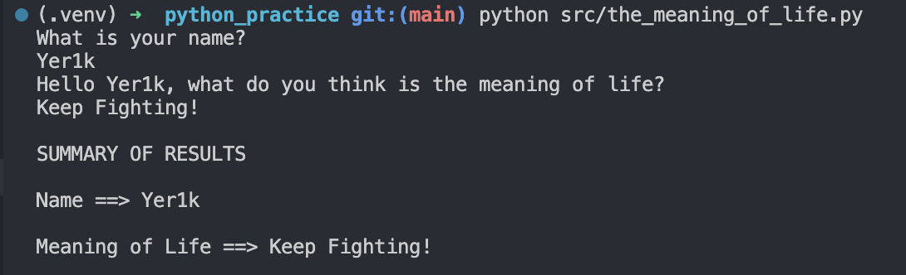
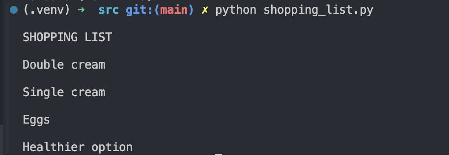

1. The meaning of life python script
    For this exercise you are invited to write a program which asks a user for two bits of information:

    - Their name; and

    - What they think is the meaning of life.

    ```python
    def theMeaningOfLife() -> None:
        """
        Ask user for their name and what they think is the meaning of life,
        then print a summary of the results.
        """
        try:
            person_name = input("What is your name?\n")
            life_meaning = input(
                f"Hello {person_name}, what do you think is the meaning of life?\n"
            )
        except KeyboardInterrupt:
            print("\nProgram interrupted by user.")
        except Exception as e:
            print(f"An error occurred: {str(e)}")

        summary = "\nSUMMARY OF RESULTS\n"
        summary += f"\nName ==> {person_name}\n"
        summary += f"\nMeaning of Life ==> {life_meaning}\n"

        print(summary)


    if __name__ == "__main__":
        theMeaningOfLife()
    ```

    

1. Modify List: Shopping_list
    Use a list to create a shopping list and change an item in the list.

    ```python
    """Use a list to create a shopping list and change an item in the list."""


    def change_shopping_list(index: int, item: str) -> None:
        """
        Demo of how to change an item in a shopping list.
        """
        shopping_list = ["Double cream", "Single cream", "Eggs", "Oreos"]
        shopping_list[index] = item

        summary = "\nSHOPPING LIST\n"
        summary = summary + "\n" + "\n\n".join(shopping_list)
        print(summary)


    if __name__ == "__main__":
        change_shopping_list(3, "Healthier option")
    ```
    


1. Extracting Data: Extract countries from a file and print them out
    Extract the countries from the file `[continent].csv` and print them out.

    ```python
    """Module to extract countries from a file and print them out."""


    def get_contents_of_file(continent_name: str) -> str:
        """
        Read the contents of a file for a given continent name.
        """
        try:
            with open(f"../data/{continent_name}.csv") as continent_file:
                lines = continent_file.read()

        except FileNotFoundError:
            lines = None

        return lines


    def get_country_dict(country_list: str) -> dict:
        """
        Take a list of countries and cities and turn them into a dictionary.
        """
        lines = country_list.splitlines()
        countries = {}

        for line in lines:
            combine = line.split(",")
            country, city = combine
            countries[country] = city

        return countries


    def print_results(continent_name: str, countries: dict) -> None:
        """
        Print out the countries and cities for a given continent.
        """
        print(continent_name)
        print("-" * len(continent_name))

        for country_name, city_name in countries.items():
            print(f"{country_name} ({city_name})")


    if __name__ == "__main__":
        continent_name = "Oceania"
        country_list = get_contents_of_file(continent_name)

        if country_list is None:
            print(f"There are no countries for {continent_name}")
        else:
            countries = get_country_dict(country_list)
            print_results(continent_name, countries)
    ```
    